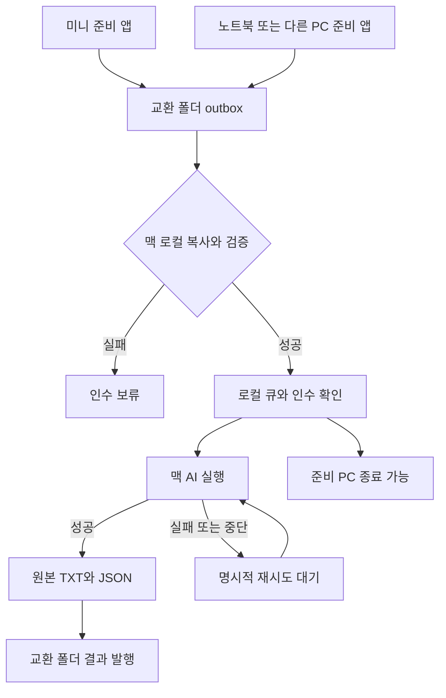
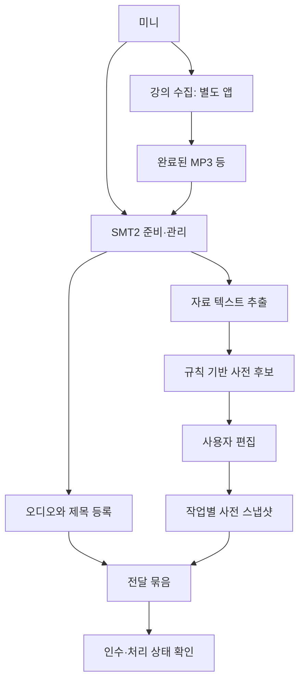

# 앱 역할과 작업 흐름

| 장비 | 실행할 앱 / 설정 | 책임 |
|---|---|---|
| 미니 (Windows) | 별도 수집 앱, SMT2 준비 앱, 선택적으로 PDF-XChange | 수집 완료 파일 선택, OCR 결과 입력, 용어 후보·사용자 편집, 전달 준비·상태 확인 |
| 노트북 / 다른 Windows PC | 필요할 때 SMT2 준비 앱 | 미니 없이 독립 준비, 고유 device_id로 제출; 개발 환경도 독립 |
| 맥미니 | SMT2 AI 허브, MLX Whisper, FFmpeg | 인수, 로컬 큐, 모든 AI 실행, 원본 결과·상태 발행 |
| NAS | 추후 공유 폴더·권한·백업 설정 | 파일 운반·공유; AI 실행·실행 큐 DB 역할 없음 |

NAS가 없어도 교환 폴더를 로컬 디렉터리로 지정해 같은 흐름을 시험할 수 있습니다. 현재 자동 감시가 없으므로 인수·전사·상태 확인을 직접 누릅니다. 맥이 꺼지면 작업은 기다립니다. 미니 AI로 자동 우회하지 않습니다.

## 미니의 작업 트리

현재 미니에서 AI를 쓸 일은 없습니다. 추후 AI 기반 사전 정제·교정 버튼은 준비 앱에서 요청만 생성하고 맥에서 처리할 계획입니다. 여러 외부 AI 제공자를 추가하더라도 키·비용·재시도 정책은 맥 허브 한 곳에서 관리합니다.

## 현재 사용자 사전의 범위

각 PC에서 후보를 자동 추출하고 편집한 사전은 그 작업에 포함되어 맥에서 사용할 수 있습니다. 동일 강의의 여러 작업에 적용하는 전역 사전·버전 충돌 병합은 아직 없습니다. 현재의 dictionary_sha256은 작업에 고정된 내용을 식별하는 해시이며, 전역 사전 버전 번호가 아닙니다.
