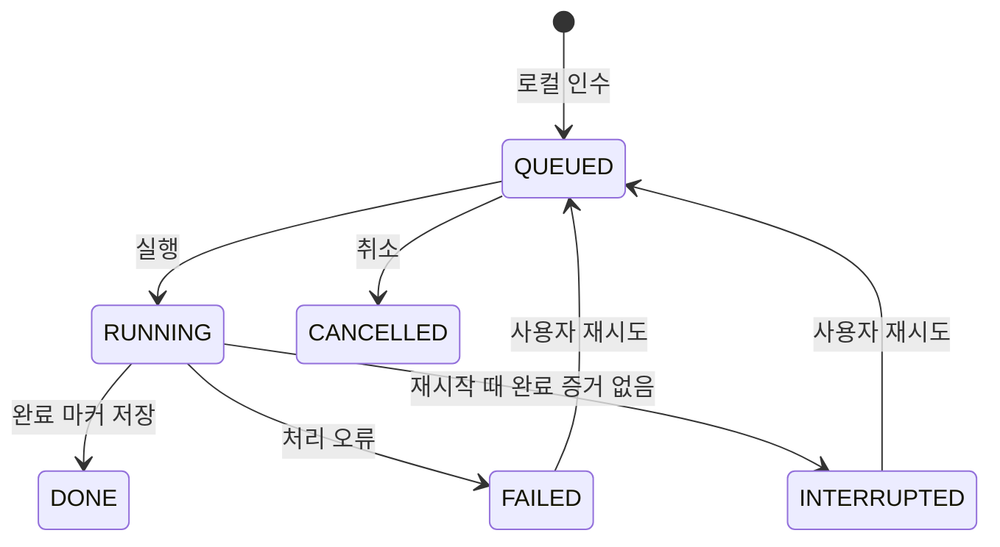

# 전달 계약 v1

교환 경로:

- `outbox/<device_id>/<request_id>/request.json`
- 같은 폴더의 `audio.mp3` / `audio.wav` / `audio.m4a` 중 하나와 `dictionary.txt`
- `receipts/<device_id>/<request_id>/status.json`
- `results/<device_id>/<request_id>/<attempt>/raw.txt`, `raw.json`, `complete.json`

두 ID는 표준 소문자 UUID다. `request.json`에는 schema=1, request_id, device_id, title, created_at, audio, audio_sha256, dictionary_sha256이 있다. 경로는 고정 파일명만 허용한다. 사전 최대 64 KB, 요청·결과 JSON 읽기는 최대 4 MB다. 전사 어댑터의 사전 힌트 제한은 별도로 2000자다. 결과 JSON이 4 MB를 넘으면 완료로 기록하지 않고 FAILED로 남기므로 긴 강의는 분할 입력한다.

준비 앱은 숨김 임시 폴더에서 파일을 완성하고 UUID 폴더로 이름을 바꾼다. 공유·동기화 시스템은 원자성을 보장하지 않을 수 있으므로 허브가 해시를 다시 검사한다. 전송 중 검증 실패는 인수로 간주하지 않으며 복사 완료 후 사용자가 다시 인수한다.

허브는 입력을 로컬 `inputs`에 복사·검증하고 SQLite에 기록한다. 이후 export가 accepted=true 상태를 발행한다. 준비 앱의 '전달 준비'와 허브의 '인수 완료'는 다르다. 미니는 인수 완료 확인 후 종료할 수 있다. 허브의 로컬 디스크 자체가 손상되거나 전원이 갑자기 끊기는 경우의 내구성은 이 테스트에서 보장하지 않는다. 제출 원본은 자동 삭제하지 않는다.

동일 request_id를 재인수해도 다시 전사하지 않는다. 다른 내용에 같은 ID를 쓰면 거부한다. 같은 오디오를 새 ID로 제출하면 별도 작업이며, 내용 기반 중복 제거는 미구현이다. 인수 당시 허브 모델 ID와 해당 작업 사전 해시를 보존한다.

추론은 허브 프로세스 안에서 실행하며 OS 파일 잠금을 계속 유지한다. 프로세스 종료 후 다음 run/export에서 RUNNING 작업을 복구한다. 완료 파일과 해시가 맞으면 DONE으로 복구하고 그렇지 않으면 INTERRUPTED로 남겨 자동 재전사를 방지한다. 새 시도는 새 숫자 폴더를 사용해 기존 결과를 보존한다. 정상 종료 전 작업 완료를 기다려야 한다.

결과의 timestamp는 유한값·음수 여부·시작 시각 순서·start≤end를 검사한다. 실제 음성 길이, 누락, 환각, 정확도는 검증하지 않는다. raw는 MLX 반환 결과의 text/language/segments(start/end/text)를 저장한 정규화 원본이다. 내부 토큰·확률 필드는 저장하지 않는다.

공유 폴더에는 인증된 접근을 별도로 설정해야 한다. SHA-256은 손상 확인이며 발신자 인증이 아니다. 공개 인터넷에 교환 경로를 노출하지 않는다. DB나 실행 환경을 공유 폴더에 두지 않는다.
